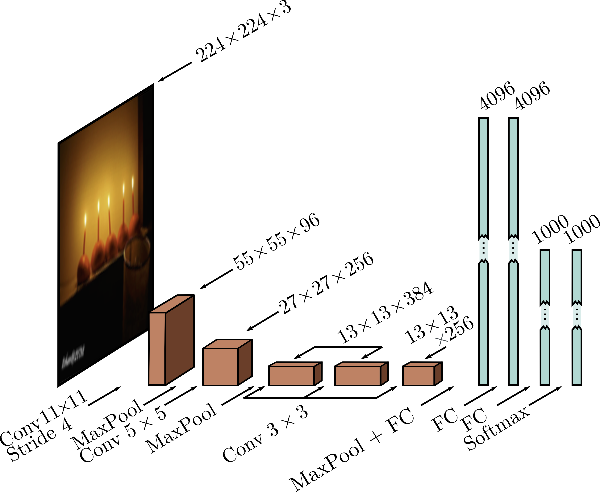
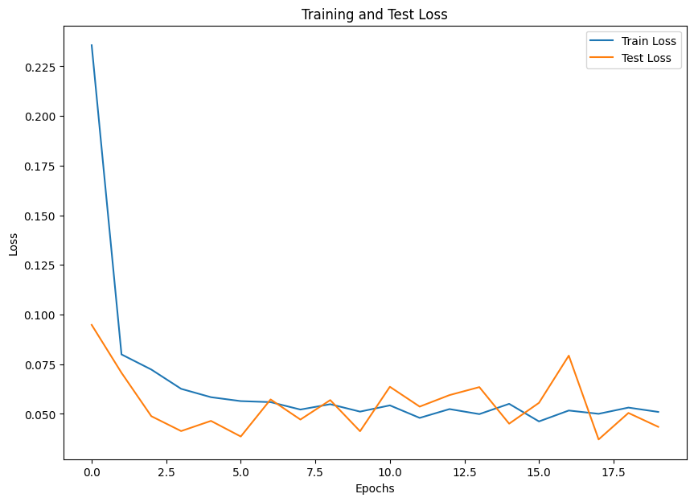
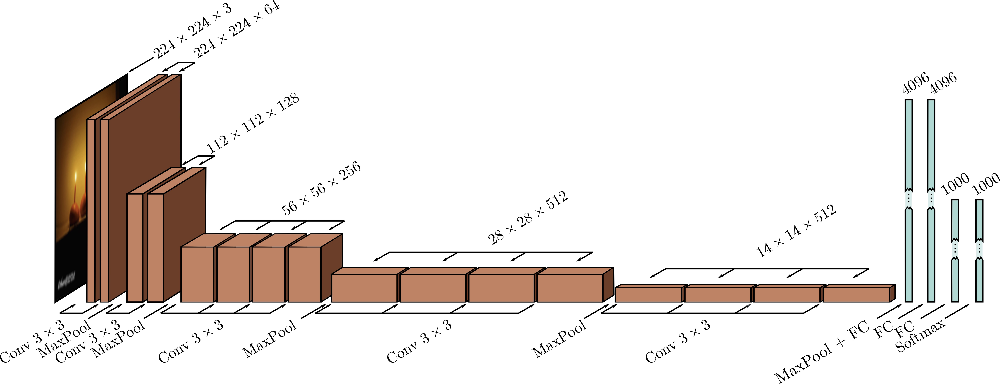

# Deep-learning
This repository holds PyTorch implementations of classic deep learning architectures.

## Architectures

### AlexNet  
[AlexNet (2012)](https://proceedings.neurips.cc/paper_files/paper/2012/file/c399862d3b9d6b76c8436e924a68c45b-Paper.pdf) is considered to be the first neural network (NN) that performed well on the ImageNet dataset (1.3M training images, 50k validation images and 100k test images containing over 1000 classes). 

The architecture is as follows (image from [Simon J.D. Prince](https://udlbook.github.io/udlbook/)):

  

For simplicity, I have used the [MNIST dataset](data/MNIST_1D/dataset_MNIST.py) and adapted the architecture, this is, changing the number of classes from 1000 to 10, and doing some preprocessing on the grayscale images (basically repeating the gray channel 3 times, so the inputs of the original AlexNet would remain the same).

[AlexNet script](Architectures/AlexNet/AlexNet_NN.py)

#### Training:

  

Both training and test loss decrease rapidly and converge, indicating good learning and no overfitting.

For the training on the MNIST dataset, we used the following hyperparameters:

| Hyperparameter   | Value        |
|------------------|-------------|
| Optimizer        | Adam        |
| Learning Rate    | 0.001       |
| Loss Function    | CrossEntropyLoss |
| Batch Size       | 32          |
| Epochs           | 20          |
| Dropout          | 0.5         |
| Input Size       | 3 x 224 x 224 |

#### Evaluation:

  

As seen in the confusion matrix, most of the classes were correctly identified, yielding a test accuracy of 98.94%.

---

### VGG-19  

The [VGG-19 (2014)](https://arxiv.org/pdf/1409.1556) architecture (from Oxford's Visual Geometry Group) is basically a deeper version of the AlexNet. This architecture showed that deeper networks led to improved results.
[VGG-19 script](Architectures/VGG-19/VGG19_NN.py)

The architecture is as follows (image from [Simon J.D. Prince](https://udlbook.github.io/udlbook/)):

  

#### Training:

For the MNIST dataset, the VGG19 network is an overkill and difficult to train. Therefore, for this architecture I used the [CIFAR-100](data/CIFAR100/dataset_CIFAR100.py) dataset and added batch normalization after each convolutional layer. For this specific dataset, we resize the images as with the MNIST to the input size shown below, and also normalize them by channel.

For the training on the CIFAR-100 dataset, we used the following hyperparameters:

| Hyperparameter   | Value        |
|------------------|-------------|
| Optimizer        | SGD         |
|                  | momentum = 0.9| 
|                  | weight decay = $5\times10^{-4}$ |
| Learning Rate    | 0.001       |
| Loss Function    | CrossEntropyLoss |
| Batch Size       | 32          |
| Epochs           | 50          |
| Dropout          | 0.5         |
| Input Size       | 3 x 224 x 224 |

## Evaluation:
<!--  -->

*Loss curves and evaluation metrics to be added after training.*

---
