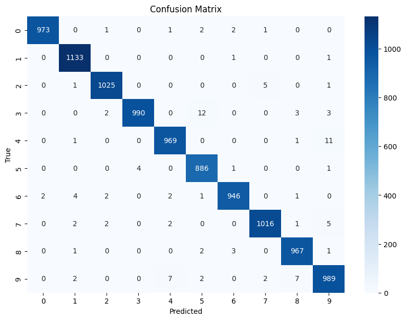

# Deep-learning
This repository hold PyTorch implementations of classic deep learning architectures.

## Architectures

### AlexNet  
[AlexNet script](Architectures/AlexNet/AlexNet_NN.py)
[AlexNet paper](https://proceedings.neurips.cc/paper_files/paper/2012/file/c399862d3b9d6b76c8436e924a68c45b-Paper.pdf)

**Evaluation:**  

  
  

*Both training and test loss decrease rapidly and converge, indicating good learning and no overfitting.*

---

### VGG-19  
[Architectures/VGG-19/VGG19_NN.py](Architectures/VGG-19/VGG19_NN.py)

**Evaluation:**  
<!--  -->

*Loss curves and evaluation metrics to be added after training.*

---
