# Deep-learning
This repository holds PyTorch implementations of classic deep learning architectures.

## Architectures

### AlexNet  
[AlexNet (2012)](https://proceedings.neurips.cc/paper_files/paper/2012/file/c399862d3b9d6b76c8436e924a68c45b-Paper.pdf) is considered to be the first neural network (NN) that performed well on the ImageNet dataset (1.3M training images, 50k validation images and 100k test images containing over 1000 classes). 

The architecture is as follows:

```mermaid
graph TD
    A[Input: 3 x 224 x 224] --> B[Conv1: 96 filters, 11x11, stride 4]
    B --> C[ReLU]
    C --> D[MaxPool1: 3x3, stride 2]
    D --> E[Conv2: 256 filters, 5x5, padding 2]
    E --> F[ReLU]
    F --> G[MaxPool2: 3x3, stride 2]
    G --> H[Conv3: 384 filters, 3x3, padding 1]
    H --> I[ReLU]
    I --> J[Conv4: 384 filters, 3x3, padding 1]
    J --> K[ReLU]
    K --> L[Conv5: 256 filters, 3x3, padding 1]
    L --> M[ReLU]
    M --> N[MaxPool3: 3x3, stride 2]
    N --> O[Flatten: 256 x 5 x 5 = 6400]
    O --> P[FC1: 6400 → 4096]
    P --> Q[ReLU]
    Q --> R[Dropout: p=0.5]
    R --> S[FC2: 4096 → 4096]
    S --> T[ReLU]
    T --> U[Dropout: p=0.5]
    U --> V[FC3: 4096 → 10]
    V --> W[Output: 10 classes]

    style A fill:#e1f5fe
    style W fill:#c8e6c9
    style B fill:#fff3e0
    style E fill:#fff3e0
    style H fill:#fff3e0
    style J fill:#fff3e0
    style L fill:#fff3e0
    style D fill:#f3e5f5
    style G fill:#f3e5f5
    style N fill:#f3e5f5
    style P fill:#fce4ec
    style S fill:#fce4ec
    style V fill:#fce4ec
    style R fill:#ffecb3
    style U fill:#ffecb3
```

With the following color coding:
| Color      | Layer Type         |
|------------|--------------------|
|  | Input Layer         |
|  | Convolutional Layer |
|  | MaxPool Layer       |
|  | Fully Connected (FC) Layer |
|  | Dropout Layer       |
|  | Output Layer        |

[AlexNet script](Architectures/AlexNet/AlexNet_NN.py)

**Evaluation:**  

  
  

Both training and test loss decrease rapidly and converge, indicating good learning and no overfitting. Test accuracy of 98.94%.

---

### VGG-19  
[Architectures/VGG-19/VGG19_NN.py](Architectures/VGG-19/VGG19_NN.py)

**Evaluation:**  
<!--  -->

*Loss curves and evaluation metrics to be added after training.*

---
